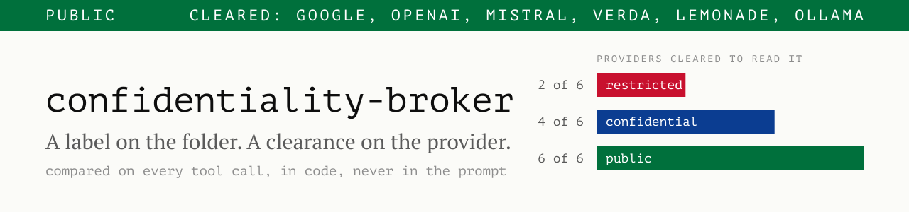

<picture>
  <source media="(prefers-color-scheme: dark)" srcset="docs/cover-dark.svg">
  
</picture>

`PUBLIC` · cleared: google, openai, mistral, verda, lemonade, ollama


# confidentiality-broker

**An agent cannot analyse data it is not allowed to read. The moment it can read it, it can
send it anywhere.** Built at AaltoAI 2026 for Norrin's *Trustworthy process monitor*
challenge: audit an undocumented industrial sensor dataset with an LLM, without the raw data
leaving the operator's environment.

Two halves, one for each half of the brief:

- **The broker** ([`.pi/extensions/confidentiality-broker/`](.pi/extensions/confidentiality-broker/)) confines
  the agent to one labelled folder and refuses any provider that is not cleared for that
  label. 109 tests.
- **The audit** ([`hyvätraportit/`](hyvätraportit/)) infers what 52 unnamed sensor tags are
  from 18 undocumented recordings, and separates real process faults from broken instruments.

**Reviewing this with five minutes?** The mechanism is [The rule](#the-rule), about a minute
of reading. What the audit found is [`hyvätraportit/summary.md`](hyvätraportit/summary.md),
one line per recording. Whether we answered the brief is
[the table further down](#where-the-brief-is-answered). The ten minute pitch is
[`demo/Norrin_Pitch.pdf`](demo/Norrin_Pitch.pdf), with its stage script and speaker notes
written out in [`demo/pitch.md`](demo/pitch.md).

## The rule

We did not try to teach the model to behave. We took the decision away from it.

A folder carries a label. A provider carries a clearance. On every tool call the broker
compares the two, and refuses if the clearance is lower, unreadable or missing.

**`.pi/confidentiality.json`**, the policy, yours to edit:

```json
{
  "levels": ["public", "confidential", "restricted"],
  "providers": {
    "google": "public",       "openai": "public",
    "mistral": "confidential", "verda": "confidential",
    "lemonade": "restricted",  "ollama": "restricted"
  }
}
```

**`demo/confidential-hr/.confidentiality.json`**, the label, one per folder:

```json
{ "level": "confidential" }
```

`google` is cleared `public`, the folder is `confidential`, so it gets nothing. Not a
summary, not a file listing, not the knowledge that the file exists:

```text
✗ refused: provider google is cleared public, workspace is confidential. no file listing.
```

The model is never asked for its opinion about this, so a prompt injection has nothing to
talk to. Every refusal is deterministic code that names the check which refused.

## Try the broker

You need [pi](https://pi.dev), docker or podman, and the API keys of the providers you want
in your shell. Running the tests additionally needs Node 22.18 or newer, because the test
files are TypeScript and rely on Node's type stripping. We ran them on 24.18. The policy and
the labelled demo folders are already in this repo.

The workspace is chosen when pi launches and cannot change during a session, so the agent
runs on one labelled folder in a container where only that folder is writable:

```bash
scripts/launch.sh demo/confidential-hr        # add --dry-run to check without starting pi
```

| Step | Command | What should happen |
| --- | --- | --- |
| 1 | Launch on `demo/confidential-hr` with model **google**, then ask *list the files* | Refused. `google` is cleared `public`, the folder is `confidential`, so the message is withheld before the provider sees it. |
| 2 | `/model ollama`, then ask *summarise employees.csv* | It works, on your machine. |
| 3 | Still in that session: `/model google` | Withheld again. The session sits at the workspace label from its first message, so a `public` provider never gets a turn. |
| 4 | `/workspaces` | Lists every labelled folder and its label. Nothing inside pi switches to one: exit and relaunch to use another. |

The footer status line shows the whole state while you do it:

```text
● confidential-hr [confidential]  ·  google [public] ✗ no access  ·  session public
```

[`demo/DEMO.md`](demo/DEMO.md) has the full script, and the labelled workspaces under
[`demo/`](demo/) hold invented data at one label each.

Run the tests:

```bash
cd .pi/extensions/confidentiality-broker && npm install && npm test   # 109 tests
```

## Try the audit

```bash
uv venv && uv pip install -r requirements.txt
```

The input is [`sensordata/`](sensordata/): 18 CSV files, 3 minute sampling, columns
`tag_01` to `tag_52`, no documentation, no units, no labels. The agent is told nothing about
them. It writes one profiling script, runs it, and reasons over that
output rather than over the rows. That is the brief's data minimisation requirement met by
construction: derived statistics are what reaches the model. Being honest about the
boundary, this is a property of how the audit is written, not something the broker enforces.
See [Limits](#limits).

**The reports are in [`hyvätraportit/`](hyvätraportit/)** ([`summary.md`](hyvätraportit/summary.md)
first, then one JSON per file). Read that folder, not `reports/`, which holds a deliberately
fast low accuracy pass kept for demo timing and says so at the top of its own summary.

What it found, in one example. `unit_06` is the clean case:

> **tag_19 is frozen at 22.57 for samples 500 to 619** while tag_08, an exact rescaling of
> it, keeps moving. The plant did not change. The instrument died.

A range alarm sees nothing there, because 22.57 is a perfectly plausible reading. The
separation matters operationally: a dead sensor and a sick plant look identical on a
dashboard and need opposite responses.

It also states what it does not know. Of the 52 tags, **27 are left `indeterminate` rather
than guessed**, and four channels that look like actuators are called out as a sampling
artefact rather than a lead.

The brief says a lower confidence inference with visible reasoning should count as stronger
than a confident sounding label with none, so every finding carries the reasoning that
produced it. This is the full entry behind that one line about `tag_19`, at confidence 0.9:

> tag_19 holds the identical value 22.57 for 120 consecutive samples (500-619); its normal
> maximum repeat run is 1 sample. Block scatter over that stretch is exactly 0.00 against a
> pooled sigma of 0.605. tag_08, which equals -(tag_19-30.57)/0.42095 exactly in all 18
> files, keeps moving normally throughout (block medians 18.08, 18.34 and scatter 1.13, 0.95
> of pooled), so the quantity itself was still changing while the tag_19 channel stopped
> reporting.

## Where the brief is answered

| Norrin asked for | Where it is |
| --- | --- |
| Infer the meaning of each unlabelled sensor | `schema` in each [`hyvätraportit/unit_*.json`](hyvätraportit/), typed from statistics and lagged correlation alone |
| Check data quality before reasoning about the process | Instrument and record faults reported separately from process events, in 11 of the 18 files |
| Detect early signs of process drift | Sustained oscillation called in `unit_04` and `unit_18`, a runaway in `unit_07` |
| Diagnose root cause and rank responsible sensors | A driver column per event, with the lag that implicates it |
| Separate inference, assumption and uncertainty | 27 tags marked indeterminate, confidences on every row |
| Keep a human able to review, question and override every conclusion | Evidence and a confidence on every finding, plus [`walkthrough/session.json`](hyvätraportit/walkthrough/session.json), which regroups the 216 findings into 24 events with the driver named, generated from the reports unmodified |
| Raw data never leaves the environment | Enforced per tool call by the broker for any labelled workspace, not promised in a prompt. `sensordata/` is not labelled yet, so for the audit this holds by construction: see [Limits](#limits) |
| A swappable, locally hosted or EU hosted model | Provider ids in one config file. `ollama` and `lemonade` run on the operator's machine; [`docs/cloud-setup.md`](docs/cloud-setup.md) covers the Finnish GPU cloud for anything heavier |
| Generalise beyond sensor data | The same broker runs unchanged over the HR and health demo workspaces |

## Limits

Said plainly, because a reviewer will find them anyway:

- **It is a guardrail, not a sandbox.** It works through pi's tool hooks. The container is
  still the real boundary.
- **A clearance is a declaration we do not verify.** A level is attached to a provider id,
  not to an endpoint we have checked is local or EU hosted.
- **The session level is coarse.** It is a high water mark, not a record of what influenced
  what. Once the session has read confidential data, everything it writes is confidential.
- **One label per folder.** A `.confidentiality.json` deeper in the tree is protected from
  writes but not honoured for reads, so keep workspaces flat.
- **The audit does not run inside the broker yet.** `sensordata/` carries no label, so the two
  halves are still two halves. The broker enforces the boundary for the demo workspaces; the
  audit's data minimisation holds because of how it is written. One command should do both,
  and that is the first thing we would build next.

The full list, including the parts we did not have time to verify, is in
[the broker's own README](.pi/extensions/confidentiality-broker/README.md#limits).

## What is in here

| Path | What |
| --- | --- |
| [`.pi/extensions/confidentiality-broker/`](.pi/extensions/confidentiality-broker/) | The broker: policy, path resolution, the gate, the status line, 109 tests |
| [`.pi/skills/`](.pi/skills/) | The audit skills: `generate-report` (the real pass), `generate-report-2` (the fast pass), `sensor-walkthrough` |
| [`sensordata/`](sensordata/) | The 18 undocumented recordings, plus [`MANIFEST.md`](sensordata/MANIFEST.md) |
| [`hyvätraportit/`](hyvätraportit/) | **The audit output.** Start with `summary.md` |
| [`reports/`](reports/) | The fast low accuracy pass. Not for decisions |
| [`demo/`](demo/) | Three labelled workspaces, the demo script, and the pitch deck |
| [`design-system/`](design-system/) | The visual system behind this page and the deck: tokens, components, guidelines |
| [`docs/`](docs/) | The challenge brief, decisions log, cloud setup, cover images |

## Data handling

This is a data sovereignty hackathon, so the repo treats sponsor data as radioactive.

- **Everything in `data/` is gitignored.** Partner datasets, exports and scratch files go there.
- **Give the agent one labeled folder at a time.** Put a `.confidentiality.json` in it and start pi with
  `scripts/launch.sh`. Providers cleared below the label get no access.
- **Secrets live in a local environment file that git ignores**, created from the committed
  example. Never commit the real one.
- The sensor CSVs and every byte in `demo/` are invented. Nothing here is a partner dataset.
- Assume this repo may be made public before judging. Nothing committed here should be
  anything you would not hand to a stranger.

## Team

Andreas Bogossian, Matias Häkkinen and Tomi Hirviniemi.